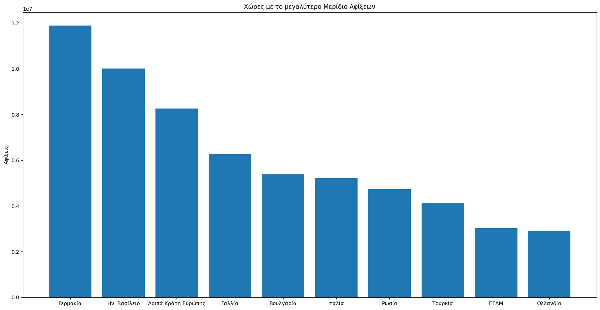
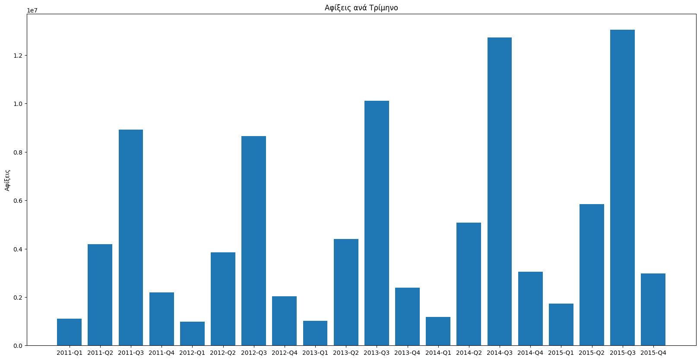
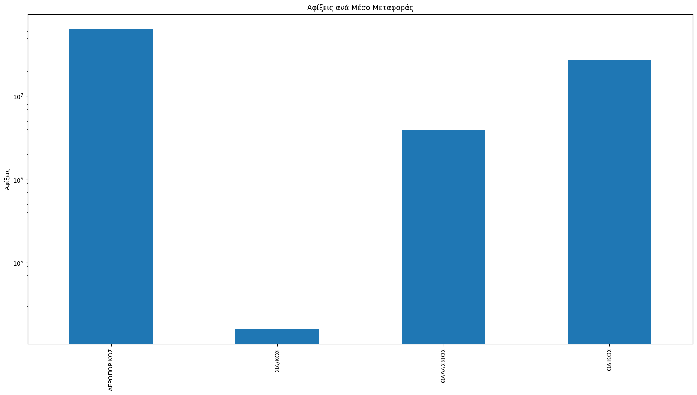
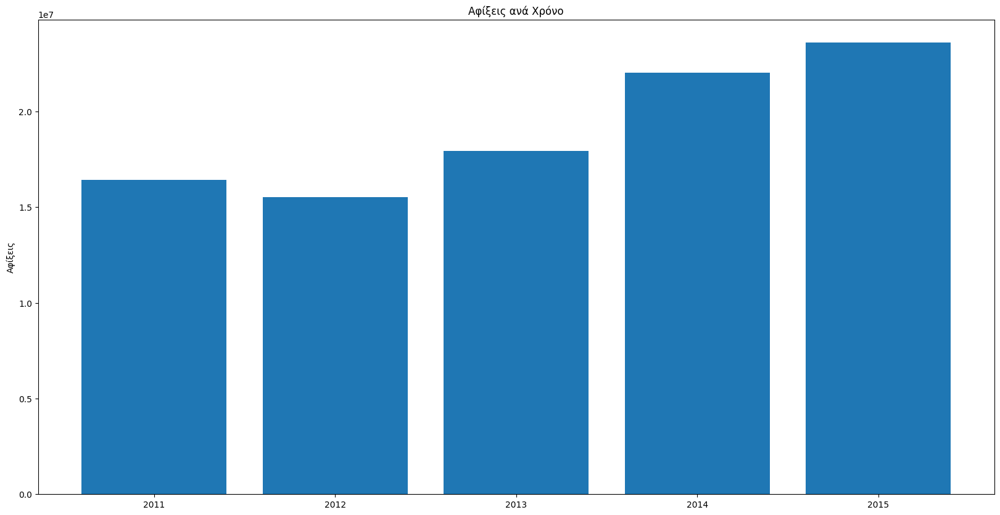

# Arrivals of non residents in Greece

Scripts included are responsible for ploting four charts about arrivals of non residents in Greece during the period 2011-2015

### Project Steps
  - Download arrival statistics from the Hellenic Statistical Authority (page scraping)
  - Process unstructured data from xls format files using pandas for cleaning
  - Export the structured data to csv files and store them to an sqlite3 database
  - Extract Graphs for various cases using matplotlib
  - Implement basic GUI for the above functionalities

### Run Order
  - downloader.py
  - storer.py
  - painter.py
  - gui.py

### Charts
| | |
|:-------------------------:|:-------------------------:|
|  |  
|  |  
